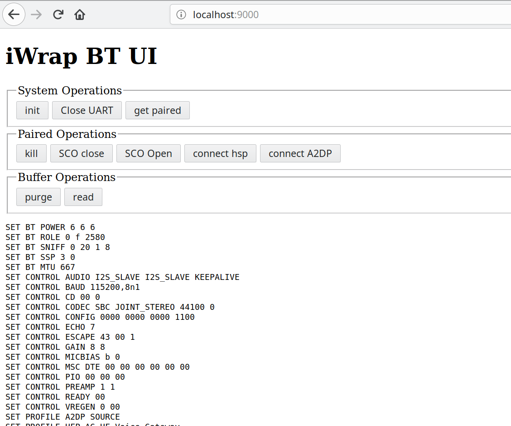

# iWrap BT UI #

## UI ##

    GET localhost:9000

## API ## 

### init ###

Open the port and wait for "READY\r\n". Timeout after 3s

    GET :9000/init

### paired ###

Finds first paired devices address from `SET`

    GET :9000/paired

### kill ###

Kill a connection to the first paired device

    GET :9000/kill

### close ###

Closes the UART port connection

    GET :9000/close

### scoclose ###

Closes SCO link connections to paired device

    :9000/scoclose

### hsp ###

Connects via HSP-AG to paired device

    GET :9000/hsp

### a2dp ###

Connects via A2DP to paired Device

    GET :9000/a2dp
